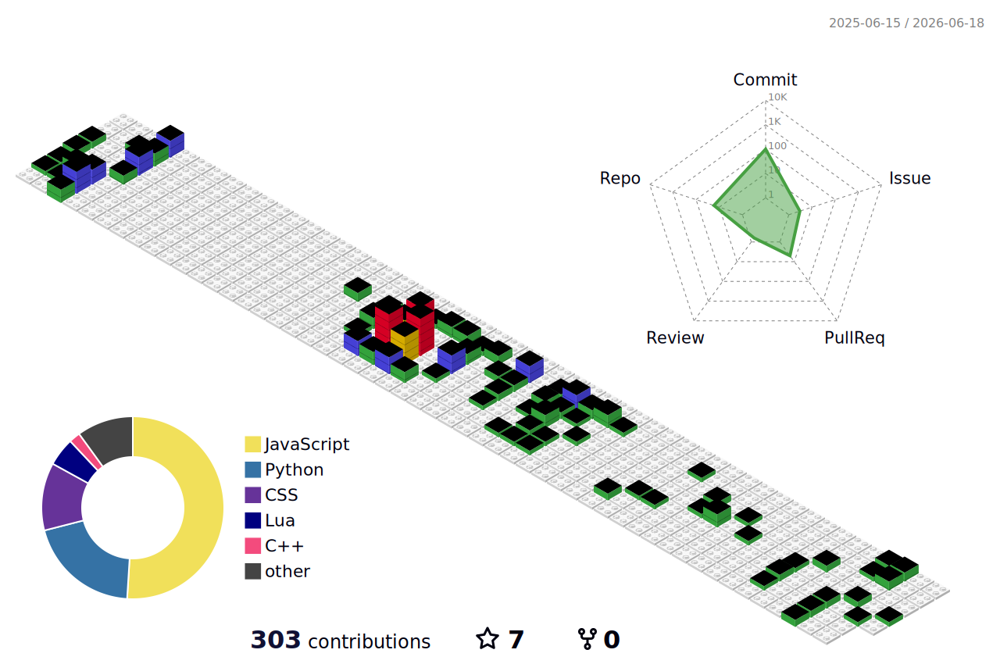

<h1 align="center">Hi 👋, I'm PEKEW</h1>
<h3 align="center">An average PhD student from China</h3>

- 📝 I regularly write articles on [wangpeike.com](wangpeike.com)

- 💬 Ask me about **Anything.**

- 📫 How to reach me **pekewang@hotmail.com**

<h3 align="left">Languages and Tools:</h3>

  
  

<!-- Engineering -->

  
  
  
  
  
  
  
  
  
  
  

<!-- Other Tools -->

  
  
  

